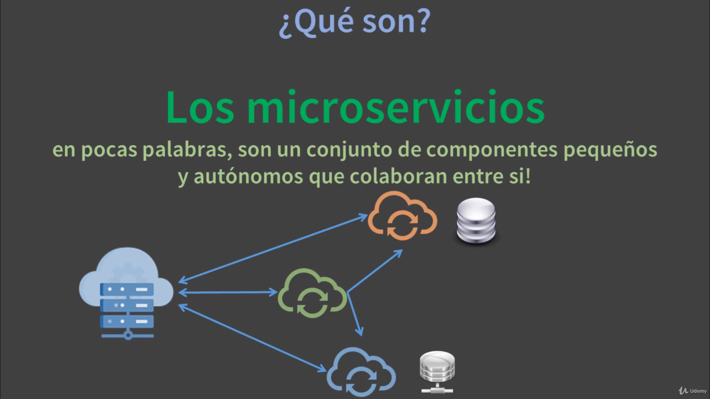

# INTRODUCCIÓN A LOS MICROSERVICIOS

Los microservicios en pocas palabras, son un conjunto de componentes pequeños y autónomos que colaboran entre sí, para llevar a cabo una gran tarea.

La gran ventaja de usar microservicios es que podemos dividir una gran aplicación y la podemos componer en mini aplicaciones o módulos.

## CARACTERÍSTICAS

- Función única.
- Independientes.
- Registro y auto-descubrimiento de servicios.
- Auto escalado y agilidad.
- Confiabilidad y tolerancia a fallos.
- Balanceo de cargas.
- Configuración centralizada

## VENTAJAS

- Nueva tecnología y adoción de procesos.
- Reducción de costo.
- Ciclos de libreación más rápidos.
- Equipos de desarrollo más pequeños.
