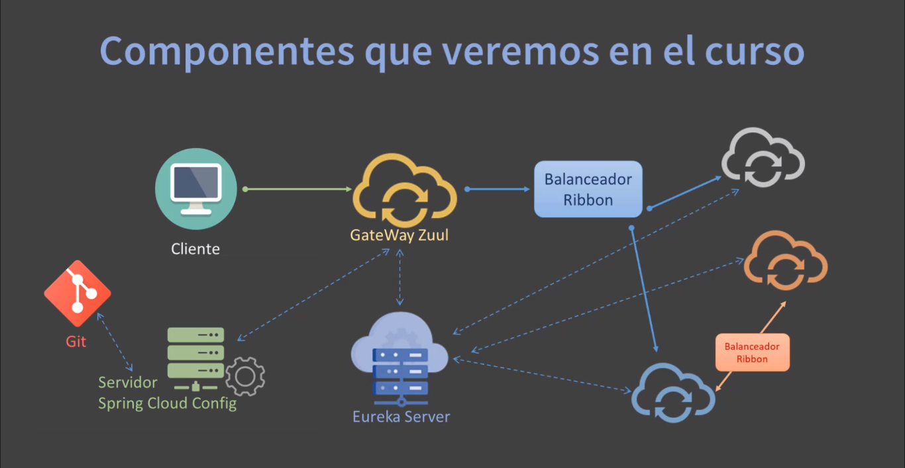

# MICROSERVICIOS CON SPRING CLOUD

Los microservicios es un enfoque que nos permite desarrollar aplicaciones que están compuestas en servicios, es decir, en vez de tener una gran aplicación (monolítica), con microservicios se tienen varios proyectos, varios servicios independientes pero que se comunican entre sí mediante API REST.

Esto hace que las aplicaciones sean mucho más fáciles de escalar y también mucho más rápida de desarrollar.

## CARACTERISTICAS

Las principales características de los microservicios:

- Autónomos
- Especializados
- Registro y auto-descubrimiento de servicios.
- Escalado flexible
- Tolerancia a fallos
- Balanceo de cargas
- Configuración centralizada
- Libertad tecnológica
- Agilidad y equipos más pequeños
- Ciclo de desarrollo más cortos
- Código reutilizable

## ¿QUÉ VEREMOS EN ESTE CURSO?

- Spring Boot
- Spring IoC
- Spring Data JPA e Hibernate
- API REST
- Spring Cloud
- Servidor Eureka Netflix
- Eureka Client
- RestTemplate
- Feign
- Ribbon
- Hystrix
- Gateway Zuul
- Spring Cloud Server Config
- Spring Security OAuth2
- JWT
- Y más..

El esquema de componentes de lo que aprenderémos:

## HERRAMIENTAS NECESARIAS PARA EL CURSO

- JDK (Java SE Development Kit)
- Spring Tools IDE (Eclipse)
- Maven
- MySQL y PostgreSQL
